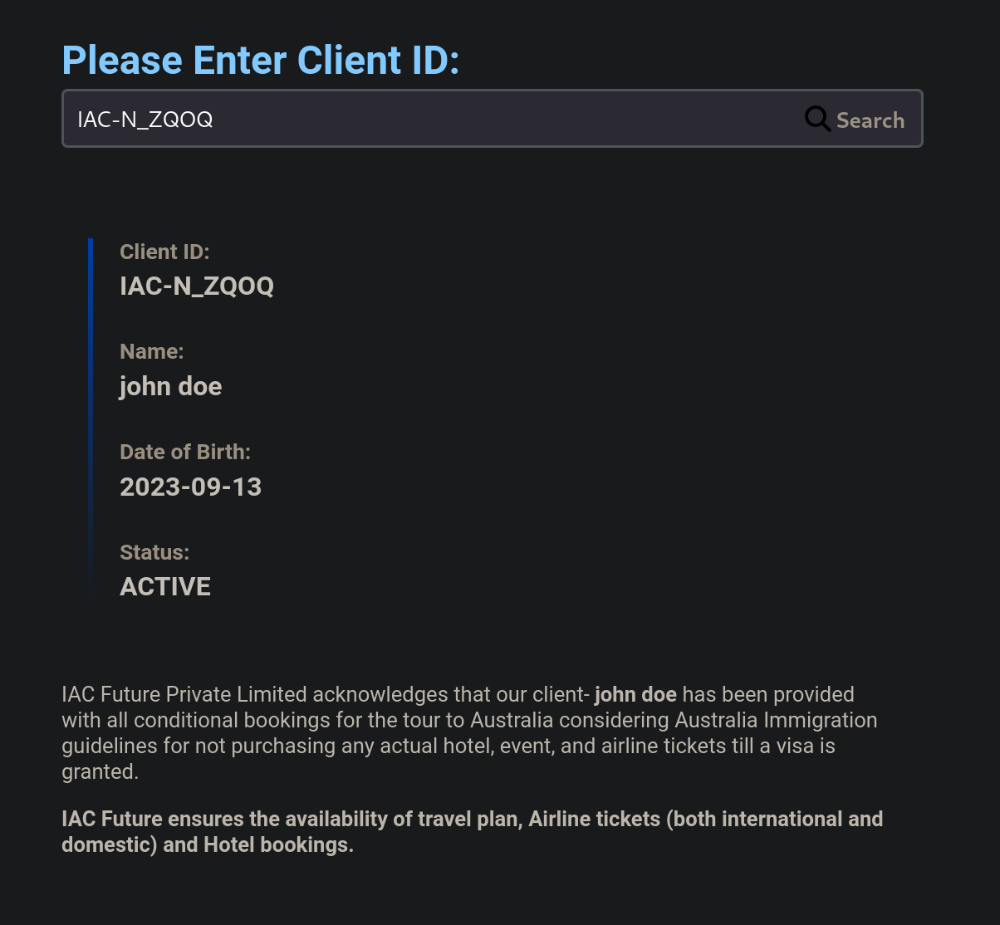
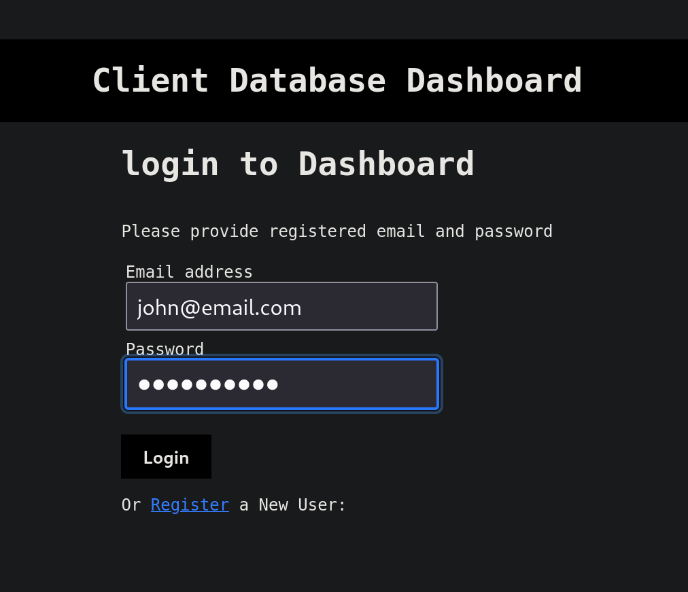
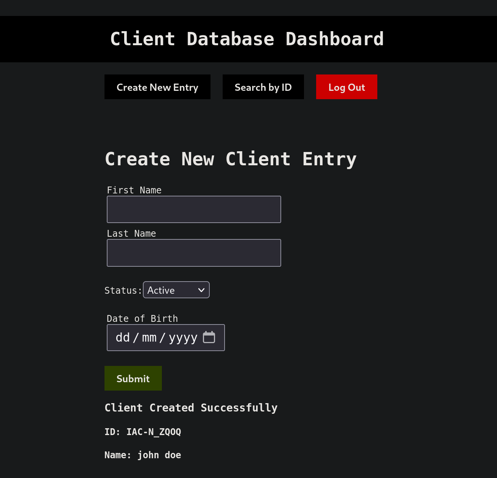

# Verify Client
Provides a mini dashboard for admin team to add Clients to Database running on shared hosting service (GODADDY.com), and allows customers to check there guarantee status online through a user interface integrated on current website.

## Front End
---
#### React 
for Dashboard 
#### Vanilla Js 
for User search interface

## Back End
---
#### Node JS
#### JWT
#### Express
#### Sequelize
#### BcryptJS

## Screen Shots:
--- 

### User Interface:
Customer Facing search bar, for querying the DB.

### Ligin Form:
Authentication and Registeration of Users of Admin Dashboard

### Admin Dashboard:
Used by the admin staff, to create entries in DB.

## Back End:
---
Backend has two different endpoint for 'users' and 'data', user endpoints handle the regisration and loging logic, while data endpoints handle the 'CRD' functionality.

## Note:
Soon to add startup Script